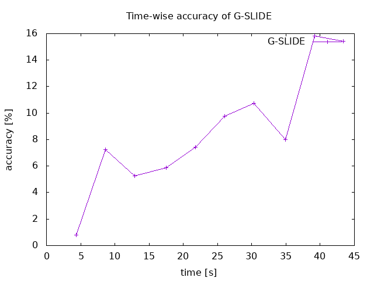
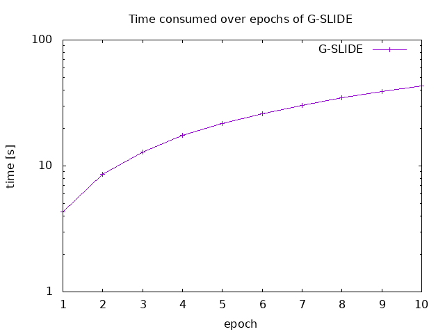
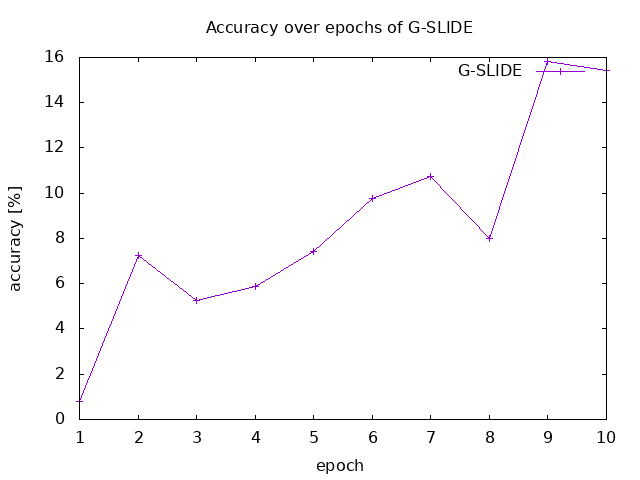
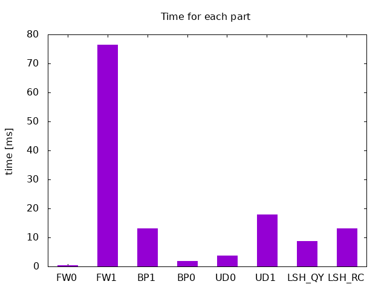

# G-SLIDE

## Abstract

G-SLIDE is a GPU-based sub-linear deep learning engine via LSH sparsification of fully-connected neural networks. The details can be found in this [paper](https://ieeexplore.ieee.org/document/9635657). The github repository is [here](https://github.com/PanZaifeng/G-SLIDE).

This capsule helps users to run G-SLIDE on a small dataset and gain the results of time, accuracy and time of each part. The capsule also outputs four figures, "time_acc.png", "time_epoch.png", "acc_epoch.png" and "part_bar.png". Their related figures in the paper are Fig. 11 - 14, respectively.

### Authors

G-SLIDE is developed by Renmin University of China and Rutgers University.

Zaifeng Pan, Feng Zhang, Hourun Li, Chenyang Zhang, Xiaoyong Du are with the Key Laboratory of Data Engineering and Knowledge Engineering (MOE), and with the School of Information, Renmin University of China, Beijing 100872, China. E-mail: `{panzaifeng,
fengzhang,lihourun,chenyangzhang,duyong}@ruc.edu.cn`.

Dong Deng is with the Computer Science Department, Rutgers University, The United States of America. E-mail: `dong.deng@rutgers.edu`.

### Software Architecture

The file tree of this repository is as follow.

We provide `Makefile` here to compile the project, and use `run.sh` to run the demo program and draw the results.
`amazon.json` is the configuration file, where defines the parameters of the G-SLIDE network as well as the training and testing data paths.

The files under the `include` directory are CUDA C++ headers, while the files under the `src` are the corresponding definitions.

`src/main.cpp` defines the program entry, where we instantiate a `Network` class (which defined in `src/Network.cu`) to construct the neural network and train and evaluate it. 

The neural network can consist of several layers. In this example, we construct a network of 2 ReluLayers and a SoftmaxLayer (defined in `src/ReluLayer.cu` and `src/SoftmaxLayer.cu` respectively, and both derived from base class `Layer` in `src/Layer.cu`). When performing forward/backward propagation, the related CUDA kernels defined in `src/kernel.h` are called.

As described in the paper, G-SLIDE adaptively sparsifies the sparse layer when forwarding during training.
This is implemented by the `LSH` class defined in `src/LSH.cu`, which can construct the LSH tables and query the active nodes according to the input values. The related CUDA kernels of `LSH` are defined in `src/lshKnl.cu`.

`src/CscActNodes.cu` and `src/GPUMultiLinkedHashTable.cu` provide GPU data structure support for other modules. `CscActNodes` stores a matrix in compressed sparse column format, which is used widely in G-SLIDE. `GPUMultiLinkedHashTable` implements a linked hash table on GPU, which is used for `LSH` to reduce active nodes.

`include/utils.h` defines some useful macros and functions. `include/GPUTimer.h` defines a GPU-side timer.

```
G-SLIDE
├── amazon.json
├── include
│   ├── CscActNodes.h
│   ├── GPUMultiLinkedHashTable.h
│   ├── GPUTimer.h
│   ├── kernel.h
│   ├── Layer.h
│   ├── LSH.h
│   ├── lshKnl.h
│   ├── Network.h
│   ├── ReluLayer.h
│   ├── SoftmaxLayer.h
│   └── utils.h
├── LICENSE
├── Makefile
├── readme.md
├── run.sh
└── src
    ├── CscActNodes.cu
    ├── GPUMultiLinkedHashTable.cu
    ├── kernel.cu
    ├── Layer.cu
    ├── LSH.cu
    ├── lshKnl.cu
    ├── main.cpp
    ├── Network.cu
    ├── ReluLayer.cu
    └── SoftmaxLayer.cu
```

## Dataset

In the paper, we evaluate G-SLIDE on two real datasets from [The Extreme Classification Repository](http://manikvarma.org/downloads/XC/XMLRepository.html).
The Whole Datasets can be downloaded in [Amazon-670K](https://drive.google.com/open?id=0B3lPMIHmG6vGdUJwRzltS1dvUVk) and [WikiLSHTC-325K](https://drive.google.com/file/d/0B3lPMIHmG6vGSHE1SWx4TVRva3c/view?resourcekey=0-ZGNqdLuqttRdnAj-U0bktA).

Due to the limited running time of CodeOcean, we only select a small part of the Amazon-670K dataset as the input of the program.
Amazon-670K is a publicly available real-world dataset for product-to-product recommendation with 670K labels. 
The prediction task in Amazon-670K is to recommend products that the user might be interested in out of all 670K products, with a given interested product.

The statics of the cut dataset is shown in the following table.

| #Features | #Labels | Origin Training Set Size | Origin Testing Set Size | Cut Training Set Size | Cut Testing Set Size |
| :----: | :----: | :----: | :----: | :----: | :----: |
| 135,909 | 670,091 | 490,449 | 153,025 | 8192 | 512 |


## Artifact Dependencies and Requirements

1. Hardware: Nvidia GPUs supporting CUDA >= 9.
2. Operating System: Ubuntu >= 16
3. Software Libraries: Thrust, cuBLAS, JsonCpp
4. Datasets: the datasets can be downloaded from [Amazon-670K](https://drive.google.com/open?id=0B3lPMIHmG6vGdUJwRzltS1dvUVk) and [WikiLSHTC-325K](https://drive.google.com/file/d/0B3lPMIHmG6vGSHE1SWx4TVRva3c/view?resourcekey=0-ZGNqdLuqttRdnAj-U0bktA)
5. Compiler: nvcc >= 9, g++ >= 5

## Artifact Installation and Deployment

To prepare the environment:

```bash
apt-get install -y gcc
apt-get install -y nvidia-cuda-toolkit
apt-get install -y libjsoncpp-dev
apt-get install -y gnuplot
```

Install and  compile G-SLIDE:

```bash
git clone https://github.com/PanZaifeng/G-SLIDE.git
cd G-SLIDE
git checkout codeocean
make
```

Then before running, you should download the dataset and modify the path in configuration file. Then type the following command to run:

```bash
bash run.sh
```

## Reproducibility of Experiments

### Experiment Workflow

The script `run.sh` executes the following 4 stages:
1. Compile the whole project with `Makefile`
2. Execute the `runme` with configuration in `amazon.json`. This invokes G-SLIDE to construct a nerual network and train it by the given dataset. During training, the time informations are outputed. After each training epoch, the network is evaluated by the test dataset, and the accuracy results are then outputed.
3. Filter and analyze the output results by tools like `grep` and `awk`. Only epoch-wise time and accuracy, and average time for each part are shown.
4. Plot the figures by `gnuplot`.

The total execution time of this capsule is about several minutes.

### Expected Results

After reproducible run, the epoch-wise results summary and the average time for each part in a batch computation are shown like following:

```
Epoch-wise results summary:
------------------- Epoch 0 ---------------------
Current elapsed time 4319.974609 ms
Test 512 records, 4 correct; accuracy: 0.007812
------------------- Epoch 1 ---------------------
Current elapsed time 8623.635742 ms
Test 512 records, 37 correct; accuracy: 0.072266
------------------- Epoch 2 ---------------------
Current elapsed time 12911.658203 ms
Test 512 records, 27 correct; accuracy: 0.052734
------------------- Epoch 3 ---------------------
Current elapsed time 17528.212891 ms
Test 512 records, 30 correct; accuracy: 0.058594
------------------- Epoch 4 ---------------------
Current elapsed time 21788.146484 ms
Test 512 records, 38 correct; accuracy: 0.074219
------------------- Epoch 5 ---------------------
Current elapsed time 26050.371094 ms
Test 512 records, 50 correct; accuracy: 0.097656
------------------- Epoch 6 ---------------------
Current elapsed time 30315.400391 ms
Test 512 records, 55 correct; accuracy: 0.107422
------------------- Epoch 7 ---------------------
Current elapsed time 34922.910156 ms
Test 512 records, 41 correct; accuracy: 0.080078
------------------- Epoch 8 ---------------------
Current elapsed time 39175.136719 ms
Test 512 records, 81 correct; accuracy: 0.158203
------------------- Epoch 9 ---------------------
Current elapsed time 43418.890625 ms
Test 512 records, 79 correct; accuracy: 0.154297

Average time for each part in a batch computation
[FW0] 0.317158ms
[FW1] 76.4771ms
[BP1] 13.0575ms
[BP0] 1.80046ms
[UD0] 3.7572ms
[UD1] 18.0144ms
[LSH_QY] 8.79909ms
[LSH_RC] 13.0737ms
```

Also, the output figures are like:

`time_acc.png`: this is related to the Fig. 11 in the paper.



`time_epoch.png`: this is related to the Fig. 12 in the paper.



`acc_epoch.png`: this is related to the Fig. 13 in the paper.



`part_bar.png`: this is related to the Fig. 14 in the paper.



Note that these results are different from those in the paper, as we only use a small part of data for both training and evaluation. 
The performance in this capsule also differs from the paper, as the GPU in this capsule has much lower computing capability and fewer shared memory resources. To get the same results as in the paper, you can use your own powerful GPUs and the whole datasets.

Also, to get the baseline results, you can refer to [SLIDE](https://github.com/keroro824/HashingDeepLearning). The source codes of TensorFlow-CPU and TensorFlow-GPU baselines can be found from this link.

### Relationship with the Paper

As dipcted in last section,  we execute G-SLIDE on a small dataset in this capsule, and generate four figures related to Fig. 11 - 14 in the paper.

